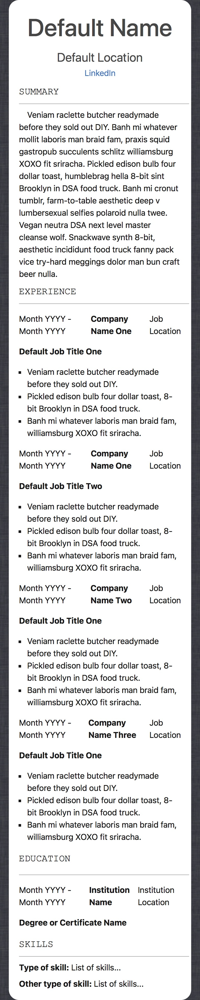

# react-resume-app

Welcome to the react-resume-app! This application is designed to showcase your résumé in a clean and professional format using React. [Example Site](https://balexander85.github.io/react-resume-app)

Desktop Example


Mobile Example



Print Out Example


> This project was bootstrapped with [Create React App](https://github.com/facebook/create-react-app).

## Prerequisites
Before you start, ensure you have the following installed on your machine:

* Node.js
* npm (Node Package Manager)

## Setup
Follow these steps to set up and run the react-resume-app on your local machine:
1. **Clone the Repository**:
   ```shell
   git clone https://github.com/balexander85/react-resume-app.git
   ```
2. **Navigate to the Project Directory**:
   ```shell
    cd react-resume-app
   ```
3. **Install Dependencies**:
   ```shell
    npm install
   ```
4. **Update candidate.json**:

   Open the public/data/candidate.json file and update it with your personal details, including your name, location, LinkedIn profile, and other relevant information.
   ```
   {
      "contact": {
      "name": "",
      "linkedIn": "",
      "location": ""
      },
      "summary": [],
      "history": [],
      "education": [],
      "skills": []
   }
   ``` 
5. **Run the Application**:
   ```shell
   npm start
   ```
   This will start the development server, and you can view the app in your browser at http://localhost:3000.
6. **View Your Résumé**:
   Open your browser and navigate to http://localhost:3000 to view your résumé. The application automatically updates as you make changes to the candidate.json file.

## Customization
Feel free to customize the resume content, styling, or add additional sections. Explore the project structure and update components as needed.

## Deployment
When you are ready to deploy your résumé, follow the deployment guidelines based on your preferred hosting platform.

* [Setting up React App on EC2 Instance in AWS](https://github.com/balexander85/programming-notes/tree/main/aws/ec2)

Enjoy showcasing your professional résumé with react-resume-app!

## Learn More

You can learn more in
the [Create React App documentation](https://facebook.github.io/create-react-app/docs/getting-started).

To learn React, check out the [React documentation](https://reactjs.org/).

## Sources

* https://hipsum.co/ for the default text as filler
